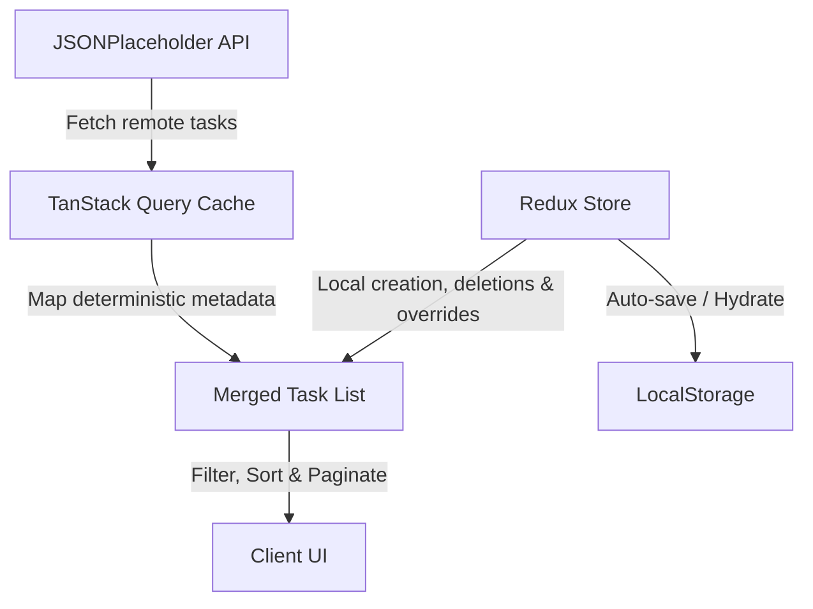

# Task Manager Mini-App

A modern, highly-polished task management application built with **Next.js App Router**, **TypeScript**, **Redux Toolkit**, **TanStack Query**, and **Tailwind CSS**.

It demonstrates best-practice frontend engineering: blending server-side rendering (SSR) hydration, client-side global state, optimistic UI updates, local storage persistence, custom hooks, and unit tests.

---

## 🚀 Quick Start

### 1. Install Dependencies
```bash
npm install
```

### 2. Run Development Server
```bash
npm run dev
```
Open [http://localhost:3000](http://localhost:3000) (redirects automatically to `/tasks`).

### 3. Run Unit Tests
```bash
npm test
```

---

## 🏗 Architecture & State Management

To handle JSONPlaceholder's static/read-only nature, the application splits state management into **Server State** and **Local State**:



### 🌐 Server State (TanStack Query)
* **API Fetching:** Retrieves remote tasks from JSONPlaceholder.
* **SSR Hydration:** Prefetches the task list on the server in [src/app/tasks/page.tsx](./src/app/tasks/page.tsx) and hydrates the query cache on the client for fast initial loads and SEO.
* **Deterministic Metadata:** Dynamically maps mock categories and priorities to API tasks using modulo arithmetic in [src/types/task.ts](./src/types/task.ts).

### 💾 Local State (Redux Toolkit)
Managed in [src/store/tasksSlice.ts](./src/store/tasksSlice.ts):
* **Local Tasks:** Newly created tasks (assignee, priority, category) are stored locally in Redux.
* **Optimistic Completion Toggles:** Updates completions immediately in Redux, overriding remote values visually without corrupting the query cache.
* **Task Deletion:** Remote task deletions are stored as Redux ID overrides; local tasks are deleted from the array.
* **State Persistence:** Automatically saves Redux state to `localStorage` and hydrates it on startup in [src/app/providers.tsx](./src/app/providers.tsx).

---

## 🌟 Implemented Features

| Feature | Key Files / Hooks | Details |
| :--- | :--- | :--- |
| **Unified Search** | [useFilteredTasks.ts](./src/hooks/useFilteredTasks.ts) | Filters merged local and remote tasks by title, status, priority, and category. |
| **Debounced Inputs** | [useDebouncedValue.ts](./src/hooks/useDebouncedValue.ts) | Debounces search input (300ms) to avoid performance lag during typing. |
| **Custom Pagination** | [usePagination.ts](./src/hooks/usePagination.ts) | Client-side pagination (10 items/page). Automatically resets to page 1 on filter/search change. |
| **Task Creation** | [TaskForm.tsx](./src/components/TaskForm.tsx) | Modal form with title length validation, assignee selection, priority buttons, and category dropdowns. |
| **Task Details** | [page.tsx](./src/app/tasks/[id]/page.tsx) | Clean detail view fetching specific tasks with error/skeleton states, deletion, and toggle buttons. |
| **Dark Mode** | [useDarkMode.ts](./src/hooks/useDarkMode.ts) | Persisted theme support with system preference detection. |

---

## 🧪 Testing

We cover critical utilities, hooks, and components with unit tests located in [src/__tests__](./src/__tests__):

* **[TaskForm.test.tsx](./src/__tests__/TaskForm.test.tsx)** - Validates form submissions, required field errors, minimum length errors, and text input trimming.
* **[usePagination.test.ts](./src/__tests__/usePagination.test.ts)** - Confirms pagination bounds clamping, navigation forwards/backwards, and reset behavior on key updates.
* **[useDebouncedValue.test.ts](./src/__tests__/useDebouncedValue.test.ts)** - Tests asynchronous timer updates and debounce delays.

